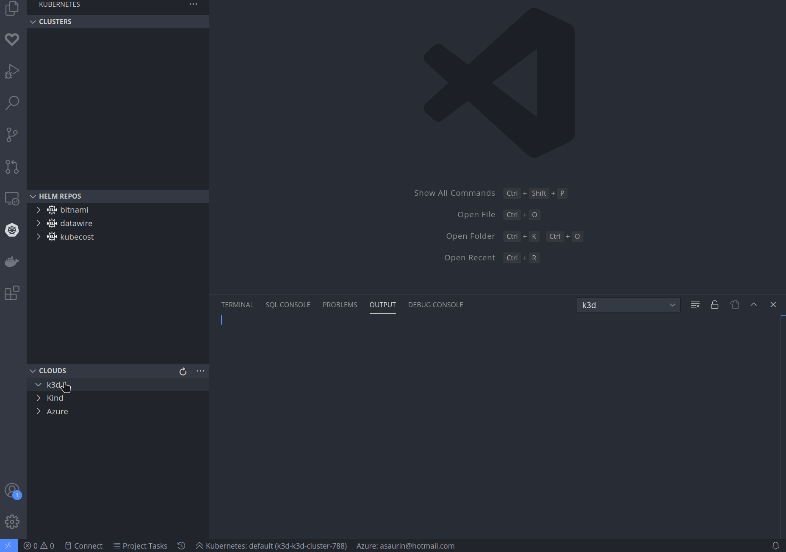
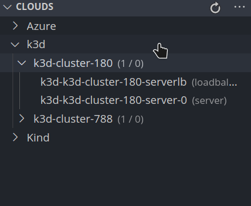
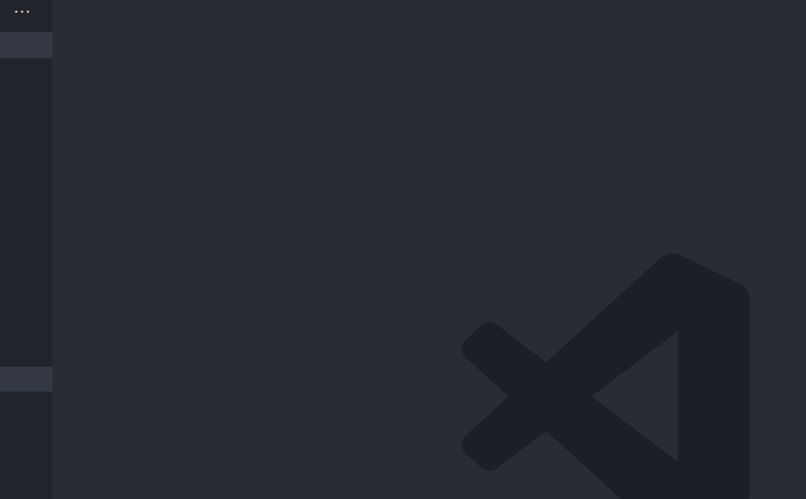
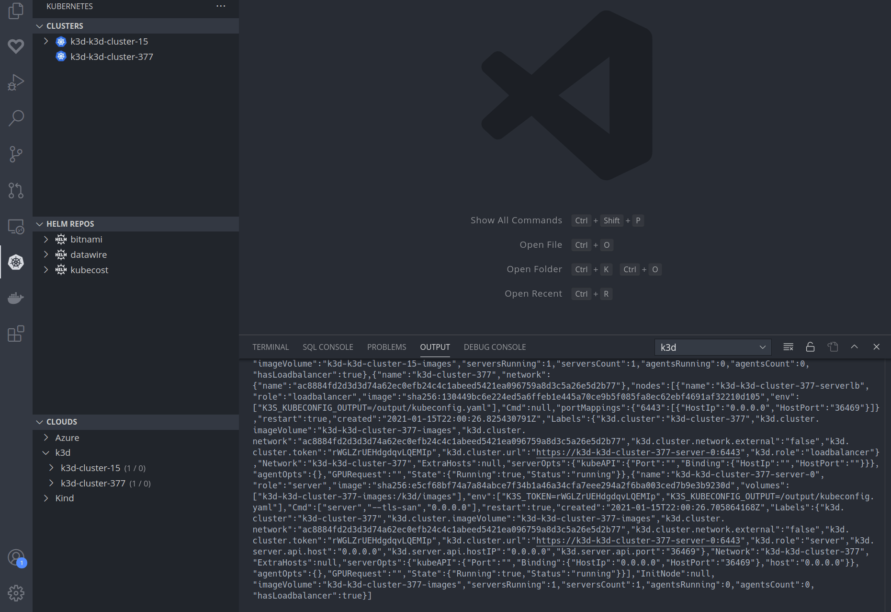
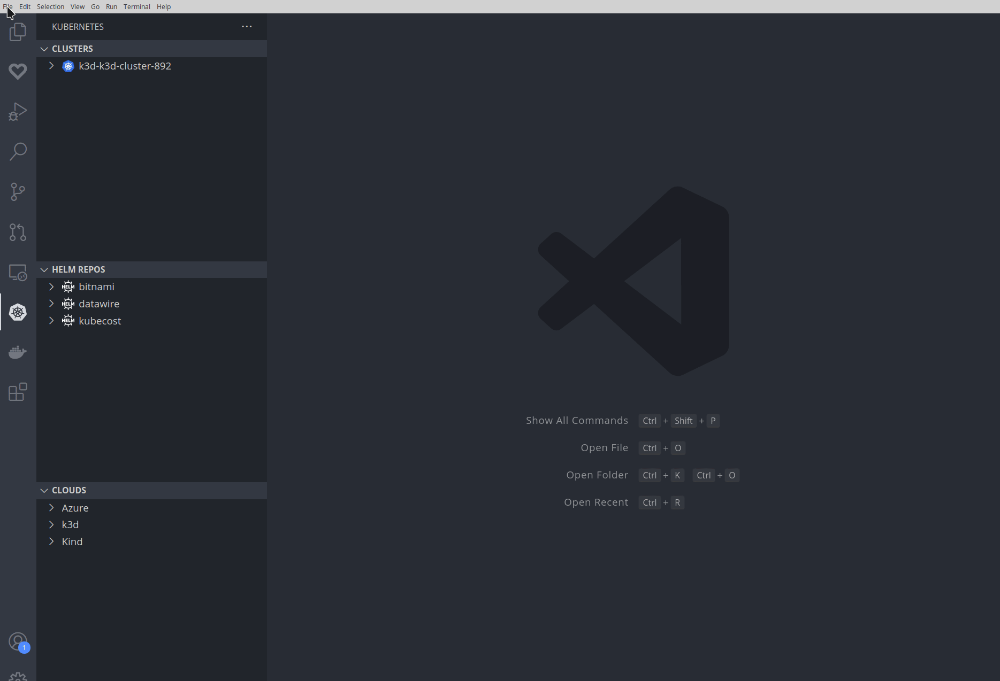

# Kubernetes [k3d](https://github.com/k3d-io/k3d) extension for Visual Studio Code


## Overview

This extension displays your [k3d](https://github.com/k3d-io/k3d) local clusters
in the Kubernetes extension's Cloud Explorer. You can use this to create and
delete clusters, and to merge them into your `kubeconfig`.

> IMPORTANT: **This is an early stage preview. It's not feature complete! Feature requests
  welcome via the issues page. (And let us know about bugs too!)**

> This project was developed by @inercia and originally based on the
  [KinD plugin for VSCode](https://github.com/deislabs/kind-vscode).

## Features

* **Create/delete** k3d clusters from the Kubernetes view.

  The k3d extension provides many options when creating new clusters, including
  proposals for nodes images that match some criteria, names of existing
  registries and networks that can be used in the new cluster, etc.

  <p></p>

* **Add/remove nodes** to/from existing k3d clusters.

  The number of Server and Agent nodes can be set not only when creating a clusterm, but you
  can also grow the cluster later on. For example, we can add a new "Agent node" to an exiting
  cluster by using the right menu available in the `Clouds` view for k3d clusters.

  <p></p>

  It is important to note that there are some **constraints on node additions and removals**:

  * Servers can only be added to clusters that were created with two or more servers or
    with the _"Growable servers"_ flag set.
  * A server cannot be removed when it is the last server in the cluster.

* **Commands and keyboard shortcuts** for all the operations.

  <p></p>

* **Replace clusters**: an existing cluster can be destroyed and a new cluster can be
  created instead. It will destroy the current cluster when no cluster is selected in the UI.

  By default, the new cluster will become the current context when the creation finishes.
  However, you can switch to some other existing cluster inmediately, without waiting for
  the creation of the new cluster, by setting the `replaceContext` flag to `oldest`.

  In the following example, cluster `k3d-cluster-377` is the current cluster, while another
  cluster, `k3d-cluster-481`, is not being used. When the _replace_ cluster command is run,
  `k3d-cluster-377` is destroyed and `k3d-cluster-481` becomes active inmediately,
  while `k3d-cluster-923` is being created in the background.

  <p></p>

  You can start using `k3d-cluster-481` without delay and, when you are done with it, a
  new `replace` will destroy it and activate `k3d-cluster-923` while another cluster will
  be created and so on.

  This feature can be used for a having a _"pool"_ of fresh clusters that are always ready
  for being used, something specially useful when you are not interested in having
  long-living clusters: just run the `replace` command and a fresh cluster will be there.

* **Automatically update the kubeconfig** after creating/deleting clusters.

## Installation

You can find this plugin in the
[VSCode Marketplace](https://marketplace.visualstudio.com/items?itemName=inercia.vscode-k3d).
You will find detailed installation instructions there.

This extension will download the latest, stable version of `k3d` automatically, although you can
force a specific instalation _channel_ of `k3d` with some settings (see [bellow](#settings)).

## Settings

This extension is controlled by a multitude of user settings. These settings can be changed
from `Preferences > Settings` in `Extensions > Kubernetes k3d` or from settings JSON file.

<p></p>

The following list contains all the options and their default values.:

| Option | Description | Default value |
| :--- | :--- | :--- |
| `k3d.updateChannel` | Update channel for downloading k3d binaries: `stable`/`all` | "all" |
| `k3d.paths` | paths for different tools. _[see following settings]_ | {} |
| `k3d.paths.k3d` | this extension will download a recent version of `k3d` automatically, but you can use your own binary by seting this parameter. You can use OS-specific binaries by using `k3d.paths.k3d-{linux,mac,windows}` instead. | "" |
| `k3d.updateKubeconfig` | update the kubeconfig after creating/destroying a cluster. It can be `always`, `never` or `onCreate`. | "always" |
| `k3d.kubeconfig` | use this kubeconfig for making modificatios after creating/destroying clusters. Note well that this kubeconfig must be in the `vs-kubernetes.knownKubeconfigs` for being shown in the clusters view. | "" |
| `k3d.defaults` | defaults for different parameters used for new K3D clusters. _[see following settings]_ | {} |
| `k3d.defaults.image` | default image for creating the Docker nodes in new K3D clusters. | "" |
| `k3d.defaults.network` | default existing network to join all the new K3D clusters. | "" |
| `k3d.defaults.numServers` | default number of server nodes for new K3D clusters. | 1 |
| `k3d.defaults.numAgents` | default number of agent nodes for new K3D clusters. | 0 |
| `k3d.defaults.serverArgs` | default K3S server arguments for new K3D clusters. | "" |
| `k3d.images` | images used for creating nodes in new K3D cluster. | {} |
| `k3d.images.proposalsRegistry`| registry used for looking for images for the cluster (defaults to the Docker Hub). | `https://registry.hub.docker.com` |
| `k3d.images.proposalsRepo` | image repository used for proposing images for nodes, including the namespace (ie, `rancher/k3s`) | `rancher/k3s` |
| `k3d.images.proposalsTagRegex` | filter proposed images tags with a _regex_ (ie, `.*v1\\.19.*` for filtering all the images with a _1.19_ tag). | "" |

Example configuration:

```JSON
    "k3d.updateKubeconfig": "always",
    "k3d.paths": {
        "k3d.paths.k3d-linux": "/home/user/bin/k3d"
    },
    "k3d.defaults": {
        "k3d.defaults.image": "docker.io/rancher/k3s:v1.19.5-k3s1"
    }
```

## Keyboard shortcuts

All the k3d extension commands can be accessed from the Visual Studio Code
[command palette](https://code.visualstudio.com/docs/getstarted/userinterface#_command-palette).
However, there are some global keyboard shortcuts pre-defined for running
some of the most frequent actions:

* `ctr+k` `ctr+c`: create a new cluster with last settings.
* `ctr+k` `ctr+r`: replace the current cluster, creating a new one with the last settings.

You can redefine the keybindings or assign new keybindings to other k3d commands by following
the [official documentation](https://code.visualstudio.com/docs/getstarted/keybindings).

> Note well that, when using the _"last settings"_, some settings will not be reused and
  a new random value will be generated, like the cluster name.

## Development

The easiest way to start coding on the extension is by following these steps:

* `git clone https://github.com/k3d-io/k3d.git`
* `code k3d`
* `npm install` in the terminal for installing all the dependencies,
* Press `F5` for starting a new VSCode window with the extension running in it.
  You can add breakpoints and so on, and you can see the debug output
  in `View > Output` and choosing the `k3d` view.
