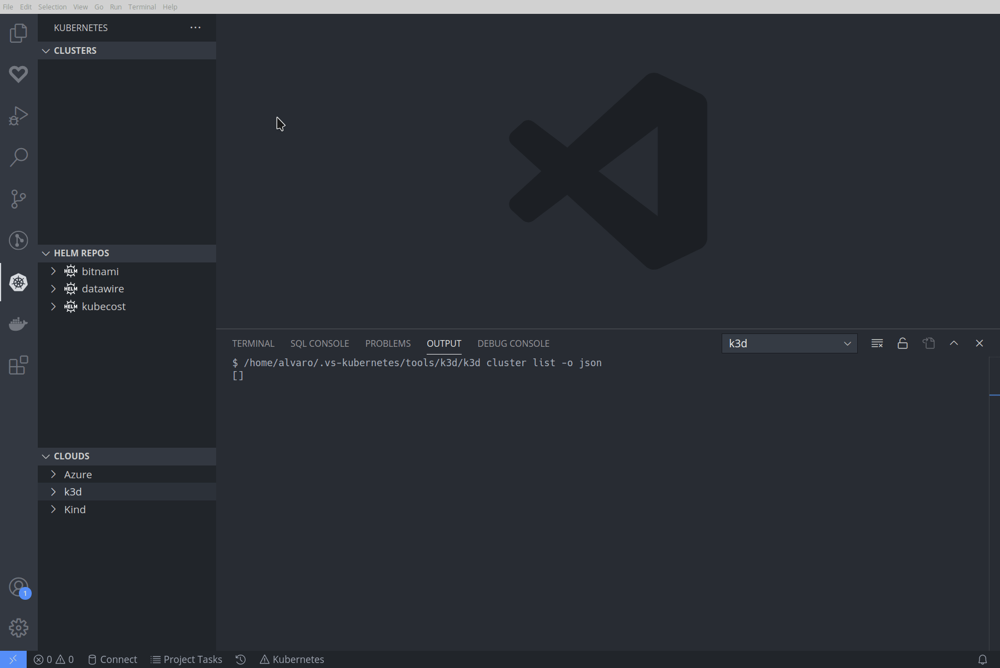

# Kubernetes [k3d](https://github.com/rancher/k3d) extension for Visual Studio Code

[](https://marketplace.visualstudio.com/items?itemName=inercia.vscode-k3d)
[](https://marketplace.visualstudio.com/items?itemName=inercia.vscode-k3d)
[](https://vsmarketplacebadge.apphb.com/rating/inercia.vscode-k3d.svg)

## Overview

This extension displays your [k3d](https://github.com/rancher/k3d) local clusters
in the Kubernetes extension's Cloud Explorer. You can use this to create and
delete clusters, and to merge them into your `kubeconfig`.



**This is an early stage preview. It's not feature complete! Feature requests
welcome via the issues page. (And let us know about bugs too!)**

This project is heavily based on the [KinD plugin for VSCode](https://github.com/deislabs/kind-vscode).

## Installation

You can find this plugin in the
[VSCode Marketplace](https://marketplace.visualstudio.com/items?itemName=inercia.vscode-k3d).
You will find detailed installation instructions there.

This extension will download the latest, stable version of `k3d` automatically, although you can
force a specific version of `k3d` with some settings (see bellow).

## Settings

This extension is controlled by a multitude of user settings.

The following list contains all the options and their default values.:

| Option | Default value | Description |
| :--- | :--- | :--- |
| `k3d.paths` | {} | paths for different tools |
| `k3d.paths.k3d` | "" | this extension will download a recent version of `k3d` automatically, but you can use your own binary by seting this parameter. You can use OS-specific binaries by using `k3d.paths.k3d-{linux,mac,windows}` instead. |
| `k3d.updateKubeconfig` | "always" | update the kubeconfig after creating/destroying a cluster. It can be `always`, `never` or `onCreate`. |
| `k3d.kubeconfig` | "" | use this kubeconfig for making modificatios after creating/destroying clusters. Note well that this kubeconfig must be in the `vs-kubernetes.knownKubeconfigs` for being shown in the clyusters view. |

Example configuration:

```JSON
    "k3d.updateKubeconfig": "always",
    "k3d.paths": {
        "k3d.paths.k3d-linux": "/home/user/bin/k3d"
    }
```

## Development

The easiest way to start coding on the extension is by following these steps:

* `git clone https://github.com/inercia/vscode-k3d.git`
* `code vscode-k3d`
* `npm install` in the terminal, then `F5` to start a new VSCode window
with the extension installed. You can add breakpoints and so on, and you
can see the debug output in `View > Output` and choosing the `k3d` view.
